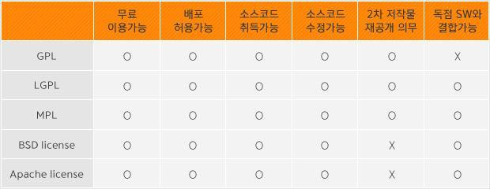
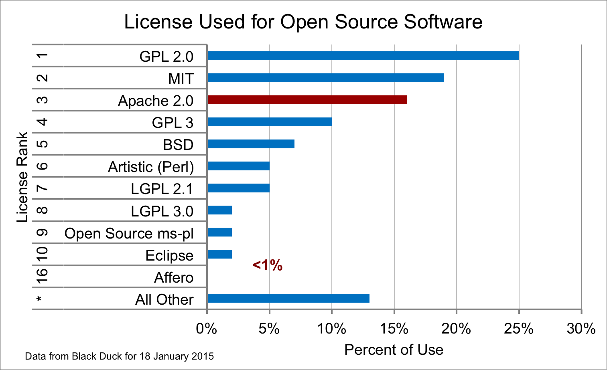

**라이선스 종류**

* GPL : General Public License. 저작권은 개발자에게 귀속되지만 소프트웨어의 복사, 수정 및 변경, 배포의 자유를 제3자에게 허용.

* LGPL : GNU Lesser General Public License. GPL을 변형해 더 허가된 형태로서, 소프트웨어 라이브러리를 염두에 둔 것.

* MPL : 모질라 공용 허가서\(Mozilla Public License\). 모질라 애플리케이션 스위트, 모질라 파이어폭스, 모질라 선더버드 및 그 외의 모질라 소프트웨어들에 적용.

* BSD license : 유닉스\(Unix\) 의 양대 뿌리 중 하나인 버클리의 캘리포니아 대학에서 배포하는 공개 소프트웨어의 라이선스. GPL보다 훨씬 개방적인 4개항의 간단한 문구로 되어 있음.

* Apache license : 아파치 소프트웨어 재단에서 자체적으로 만든 소프트웨어에 대한 라이선스 규정. 누구나 해당 소프트웨어에서 파생된 프로그램을 제작할 수 있으며 저작권을 양도, 전송할 수 있는 라이선스 규정을 의미.

출처 : [티스토리 블로그](http://yoon-talk.tistory.com/114)

2015년 2월 기준의 라이선스 사용 통계

출처 : [https://osswatch.jiscinvolve.org/wp/2015/02/05/open-source-software-licensing-trends/](https://osswatch.jiscinvolve.org/wp/2015/02/05/open-source-software-licensing-trends/)

