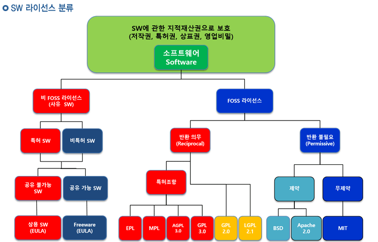
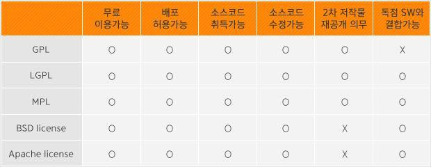
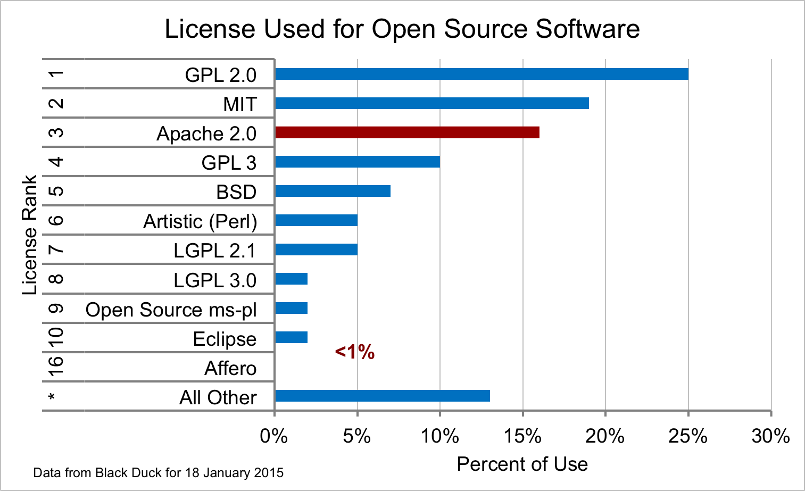

**오픈 소스란 무엇인가?**

**+오픈 소스 소프트웨어 라이선스**

-**무상으로 공개된 소스코드 또는 소프트웨어. 혹은 프리웨어**

오픈소스 소프트웨어, OSS라고도 한다. 소프트웨어의 설계도에 해당하는 소스코드를 인터넷 등을 통하여 무상으로 공개하여 누구나 그 소프트웨어를 개량하고, 이것을 재배포할 수 있도록 하는 것 또는 그런 소프트웨어를 말한다.

**Open Source Initiative에 소개된 오픈소스 정의**

기본적이지만 궁극적으로 지켜져야 하며, 오픈소스가 지향하는 목표들

**소개**

오픈 소스는 소스 코드에 대한 엑세스를 의미하지 않습니다. 오픈 소스 소프트웨어의 배포 조건은 다음 기준을 준수해야 합니다.

**1. 자유로운 재배포**

오픈 소스를 이용하여 제작한 소프트웨어의 자유로운 배포를 허용해야 합니다. 그리고 사용된 오픈 소스에 대한 어떠한 비용도 받지 않아야 합니다.

- 이와 같은 원칙이 지켜지지 않는다면 오픈 소스를 개발하는 사람들의 개발의지가 꺾일 것이며, 이로 인해 장기적인 이익도 기대할 수 없기 떄문입니다.

**2. 원시 코드**

오픈 소스는 원시코드(Source Code)가 포함되어야 하며, 최소의 실비만으로도 원시코드를 구할 수 있도록 하여야 합니다. 또한 원시코드는 고의로 알아보기 어렵게 만들어지지 않아야 합니다.

- 오픈 소스는 기본적으로 소스의 수정과 변형을 전제로 하기 때문에 최대한 이용하기 쉽게 작성되도록 노력해야 합니다.

**3. 파생 저작물**

개작과 파생 저작물을 허용해야 합니다. 그리고 이렇게 파생된 저작물에는 원본 오픈 소스에 적용된 라이선스를 똑같이 적용할 수 있도록 해야 합니다.

- 이 원칙은 1번 원칙과 비슷하게 파생 저작물 역시 빠르고 혁신적으로 발전할 수 있는 바탕이 됩니다.

**4. 저작자의 원시 코드 원형 유지**

바이너리(2를 기반으로 하는 숫자 체계, 컴퓨터에서 데이터를 표현하기 위해 사용됨)를 생성할 시점에서 프로그램을 수정할 목적으로 패치 파일의 배포를 허용한 경우에 한해, 변경된 원시 코드의 배포를 제한할 수 있습니다. 그러나 변경된 원시코드가 아닌 그것을 통해 만들어진 결과물의 배포는 허용해야만 합니다. 파생 저작물에 대해서는 원본 오픈 소스와 다른 이름이나, 버전을 적용하도록 할 수 있습니다.

- 이러한 조치는 소스코드의 원작자와 수정인의 정보를 나눔으로써 사용자가 피드백이 필요한 부분에 대한 의견을 누구에게 문의할지 명확하게 해줍니다.

**5. 개인이나 단체에 대한 차별 금지**

라이선스는 특정 개인이나 단체를 차별하지 않아야 합니다.

- 개인 또는 단체 모두 오픈 소스의 개발과 발전에 큰 보탬이 될 수 있으므로 그 누구도 차별하지 않고, 오픈 소스를 이용할 수 있어야 합니다. 일부 국가에서는 특정한 종류의 소프트웨어에 대하여 수출 금지를 하고 있지만 그것에 대한 법률을 준수해야 한다는 경고를 하는 수준에 그치고 있고, 라이선스 자체에 금지 규정을 싣지는 않고 있습니다.

**6. 사용분야에 대한 차별 금지**

라이선스는 소프트웨어가 특정 분야에서 사용되는 것을 금지해서는 안됩니다. 예를 들어, 영리기업이나 유전학 연구에 프로그램을 사용할 수 없다는 등과 같은 제한을 설정해서는 안됩니다.

- 상업적 영역에서도 오픈 소스가 사용될 수 있도록 하여야 합니다.

**7. 라이선스의 배포 **

프로그램에 첨부된 권리는 별도의 라이선스를 적용하지 않고, 재배포를 하는 프로그램의 이용자에게도 동일하게 적용되어야 합니다.

- 비공개 동의를 요구하는 것처럼 간접적인 방법으로 소프트웨어를 제한하는 것을 방지합니다.

**8. 특정 제품에만 유효한 사용 허가의 금지**

프로그램에 첨부된 권리는 특정한 소프트웨어의 배포에 일부분일 경우, 한정적이어서는 안됩니다. 만약 배포된 프로그램의 라이선스 내에서 추출∙이용∙배포되더라도, 재배포 받은 이용자는 원본 프로그램의 라이선스와 같은 권리를 가집니다.

- 다른 종류의 라이선스를 방지 합니다.

**9. 다른 소프트웨어에 대한 제한 금지**

라이선스는 다른 라이선스를 가진 소프트웨어에 대한 제한을 포함해서는 안됩니다. 예를 들어 함께 배포되는 모든 소프트웨어가 오픈 소스 라이선스여야만 한다고 강제할 수 없습니다.

- 오픈 소스 소프트웨어의 배포자는 자신들의 고유한 소프트웨어 선택권이 있기 때문입니다.

**10. 라이선스는 기술 중립적이어야 합니다. **

라이선스의 조항은 개인적인 기술이나, 인터페이스 스타일에 국한될 수 없습니다.

- 이 조항은 사용 허가자와 사용자 사이에 명시적인 동의가 필요한 특별한 라이선스를 목적으로 합니다. 라이선스 동의를 클릭방식으로 강제하는 조항은 FTP 다운로드나, CD-ROM 배포 방식이나, 웹미러링(파일 동기화의 일종) 등의 방식과 충돌을 일으킬 수 있으며, 코드 재사용을 방해할 수도 있습니다. 라이선스는 웹이나, 팝업 GUI(그래픽 사용자 인터페이스)등을 지원하지 않는 환경에 대해서도 고려를 해야 합니다.

출처 : [http://yoon-talk.tistory.com/114](http://yoon-talk.tistory.com/114)

원문 : [https://opensource.org/osd-annotated](https://opensource.org/osd-annotated)

**오픈소스 소프트웨어 라이선스**

공개SW(Open Source Software) 라이선스란 **공개SW 개발자와 이용자 간의 사용 방법 및 조건의 범위를 명시한 계약**을 말한다. 따라서 공개SW를 이용하려면 공개SW 개발자가 만들어놓은 조건의 범위에 따라 해당 소프트웨어를 사용해야 하며, 이를 **위반할 경우에는 라이선스 위반 및 저작권 침해로 이에 대한 법적 책임을 져야**한다

출처 : [http://www.oss.kr/oss_intro06](http://www.oss.kr/oss_intro06)

**라이선스 종류**

- GPL : General Public License. 저작권은 개발자에게 귀속되지만 소프트웨어의 복사, 수정 및 변경, 배포의 자유를 제3자에게 허용.

- LGPL : GNU Lesser General Public License. GPL을 변형해 더 허가된 형태로서, 소프트웨어 라이브러리를 염두에 둔 것. 

- MPL : 모질라 공용 허가서(Mozilla Public License). 모질라 애플리케이션 스위트, 모질라 파이어폭스, 모질라 선더버드 및 그 외의 모질라 소프트웨어들에 적용.

- BSD license : 유닉스(Unix) 의 양대 뿌리 중 하나인 버클리의 캘리포니아 대학에서 배포하는 공개 소프트웨어의 라이선스. GPL보다 훨씬 개방적인 4개항의 간단한 문구로 되어 있음.

- Apache license : 아파치 소프트웨어 재단에서 자체적으로 만든 소프트웨어에 대한 라이선스 규정. 누구나 해당 소프트웨어에서 파생된 프로그램을 제작할 수 있으며 저작권을 양도, 전송할 수 있는 라이선스 규정을 의미.

출처 : [http://yoon-talk.tistory.com/114](http://yoon-talk.tistory.com/114)

2015년 2월 기준의 라이선스 사용 통계

출처 : https://osswatch.jiscinvolve.org/wp/2015/02/05/open-source-software-licensing-trends/

